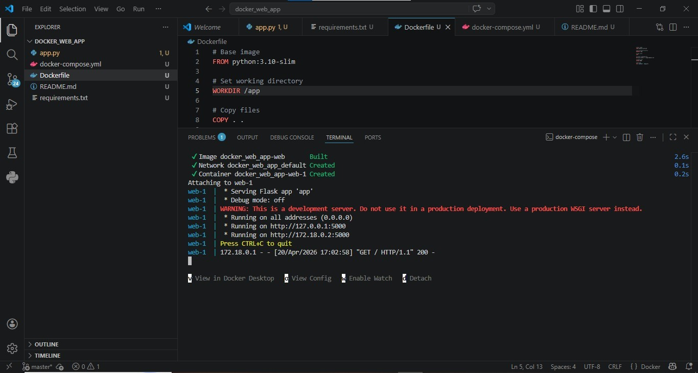
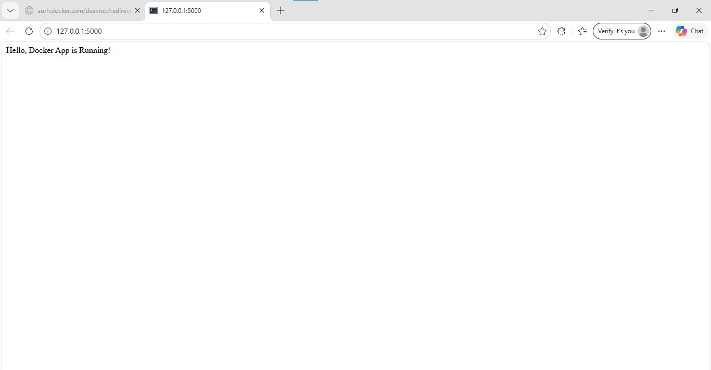

# docker-web-app

##  Description
This is a simple Python Flask app containerized using Docker.

##  How to Run

### Build Image
docker build -t myapp .

### Run Container
docker run -p 5000:5000 myapp

### OR using Docker Compose
docker-compose up

##  Output
Run the application locally and open in browser.
Open: http://127.0.0.1:5000

##  Screenshot Task 1

## 📷 Task 3: Terraform Output

